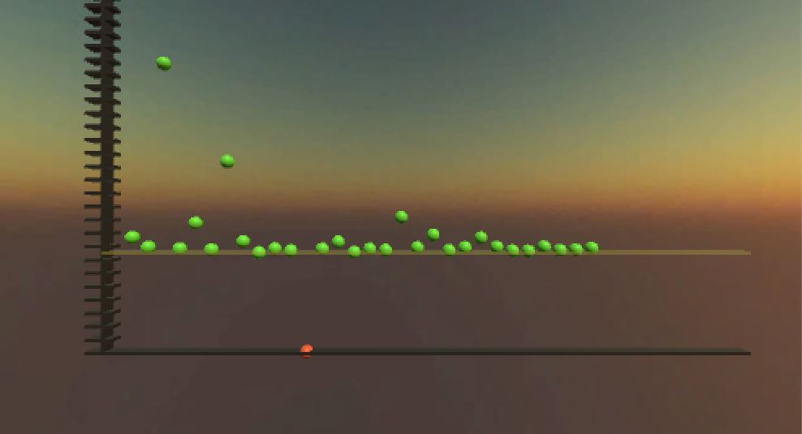

# 750WordsDataViz
Two data visualizations using data from 750Words.com for the year 2011.

This Unity program takes in data from 750 Words and visualizes it in a virtual reality 3D scene using SteamVR.

## How to use
Open up the "DataViz" executable in the "Builds" folder.

Use the **spacebar** to advance between each month's data, and the **1** and **2** keys to switch between the active visualization.

The first visualization is a graph of the number of words written each day of the month. Data points are green if the word count is over the target 750 words. The Y axis marks every 100 words.

The second visualization is a word cloud of the most frequently used words in that month, with size of the word scaled up based on the frequency of the word used.

## Credits
CSVReader by Dock. (24/8/11)
http://starfruitgames.com

Made for UCSC's Computational Media -- Immersive Analytics class.
